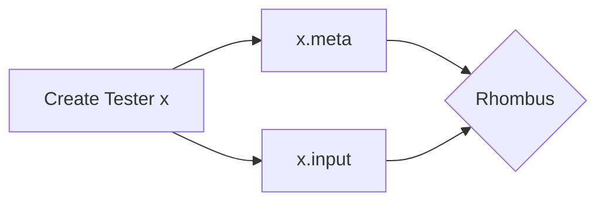

# Test_Manager

*Test Manager* is a bit of an involved tester. It's designed to be adaptable to various types of programs. You can use this program to make a new program to test YOUR program. The way it works is this:

1. You find an application you want to test.
2. With *Test Manager*, you select to create a new tester.
3. Suppose you create tester `x`. You'll get two files, `x.meta` and `x.input`. The `.meta` file contains the name of the application you are testing, as well as how many lines down in the output we can retrieve the answer. The `.input` file contains the needed input to get to the *exact* input you are testing. For example, if you had a switch and a couple of options before getting to where you needed to test your program, we would have the input to go through that switch and the other options.
4. Once you have a created tester, you can begin updating it; adding a specific input/output test or removing them. You can of course delete it as well.
5. Once you are ready to test your program, create the actual tester for your program. *Test Manager* will read through your stored inputs and outputs and generate a tester for you to use. Make sure when running the generated tested program, it's found in the same directory.

